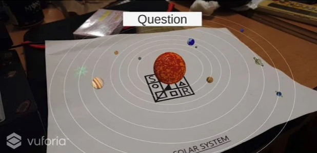

# About
Augmented Science provides both educational assistance and resources which is actually the main purpose of our app. This app can be used during lessons and lectures by using the AR models and diagrams to give students a better visual understanding. Teachers can also use the app to motivate students to increase class participation. The app will provide the necessary materials, tools and equipments that are needed to help students help them expand their knowledge of science.

[View our app on Google Play Store!](https://play.google.com/store/apps/details?id=com.Eicon.Augmented_Science&hl=en_US&gl=US])

### Augmented Reality

We believe the best way to provide access to free scientific education is to provide the resources through augmented reality. This provides the developers access to scale and upgrade scientific resources.

### Gamification

Gamification is the best learning methodology to provide students a safe and interactive scientific experiment. Our app provides free educational assistance and resources such as chemistry and astronomy that can be used as an asset for lessons and lectures.
